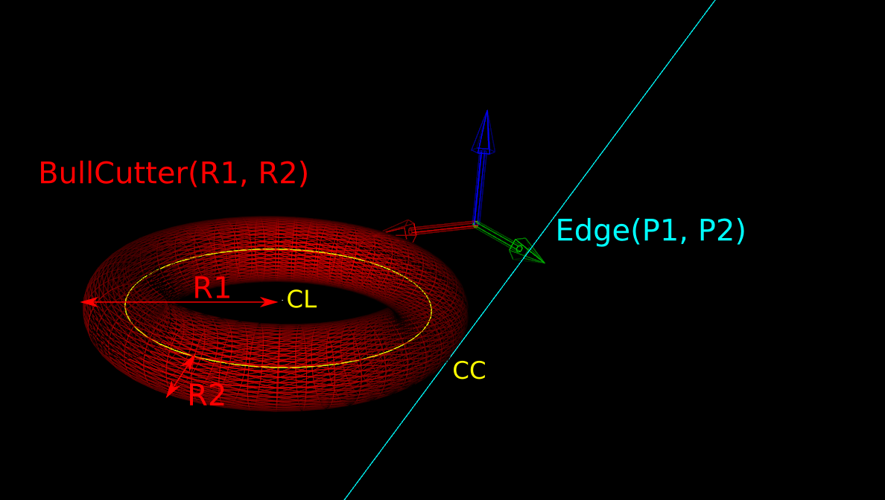

```
https://web.archive.org/web/20240930192830/http://www.anderswallin.net/category/cnc/cam/drop-cutter-cam/
```


### Drop-Cutter toroid edge test


The basic CAM-algorithm called axial tool projection, or drop-cutter, works by dropping down a cutter along the z-axis, at a chosen (x,y) location, until we make contact with the CAD model. Since the CAD model consists of triangles, drop-cutter reduces to testing cutters against the triangle vertices, edges, and facets. The most advanced of the basic cutter shapes is the BullCutter, a.k.a. Toroidal cutter, a.k.a. Filleted endmill. On the other hand the most involved of the triangle-tests is the edge test. We thus conclude that the most complex code by far in drop-cutter is the torus edge test.

The opencamlib code that implements this is spread among a few files:


millingcutter.cpp translates/rotates the geometry into a "canonical" 
configuration with CL=(0,0), and the P1-P2 edge along the X-axis.

bullcutter.cpp creates the correct ellipse, calls the ellipse-solver, returns the result

ellipse.cpp ellipse geometry

ellipseposition.cpp represents a point along the perimeter of the ellipse

brent_zero.hpp has a general purpose root-finding algorithm


The special cases where we contact the flat bottom of the cutter, or the cylindrical shaft, are easy to deal with. So in the general case where we make contact with the toroid the geometry looks like this:


```
https://web.archive.org/web/20240930192830/http://en.wikipedia.org/wiki/Torus

```





```
https://web.archive.org/web/20250325180844if_/http://www.anderswallin.net/wp-content/uploads/2014/02/oe1_text.png

```


