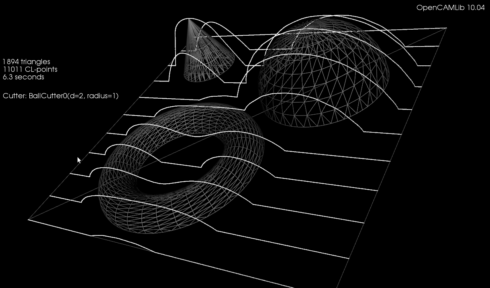

Per_page = 10


```

https://web.archive.org/web/20240930192830/http://www.anderswallin.net/category/cnc/cam/drop-cutter-cam/
```


### Drop-Cutter toroid edge test


The basic CAM-algorithm called axial tool projection, or drop-cutter, works by dropping down a cutter along the z-axis, at a chosen (x,y) location, until we make contact with the CAD model. Since the CAD model consists of triangles, drop-cutter reduces to testing cutters against the triangle vertices, edges, and facets. The most advanced of the basic cutter shapes is the BullCutter, a.k.a. Toroidal cutter, a.k.a. Filleted endmill. On the other hand the most involved of the triangle-tests is the edge test. We thus conclude that the most complex code by far in drop-cutter is the torus edge test.

The opencamlib code that implements this is spread among a few files:


millingcutter.cpp translates/rotates the geometry into a "canonical" 
configuration with CL=(0,0), and the P1-P2 edge along the X-axis.

bullcutter.cpp creates the correct ellipse, calls the ellipse-solver, returns the result

ellipse.cpp ellipse geometry

ellipseposition.cpp represents a point along the perimeter of the ellipse

brent_zero.hpp has a general purpose root-finding algorithm


The special cases where we contact the flat bottom of the cutter, or the cylindrical shaft, are easy to deal with. So in the general case where we make contact with the toroid the geometry looks like this:


Here we've fixed the XY coordinates of the cutter location (CL) point, and we're using a filleted endmill of radius R1 with a corner radius of R2. In other words R1-R2 is the major radius and R2 is the minor radius of the Torus. The edge we are testing against is defined by two points P1 and P2 (not shown). The location of these points doesn't really matter, as we do the test against an infinite line through the points (at the end we check if CC is inside the P1-P2 edge). The z-coordinate of CL is the unknown we are after, and we also want the cutter contact point (CC).


There are many ways to solve this problem, but one is based on the offset ellipse. We first realize that dropping down an R2-minor-radius Torus against a zero-radius thin line is actually equivalent to dropping down a zero-minor-radius Torus (a circle or 'ring' or CylCutter) against a R2-radius edge (the edge expanded to an R2-radius cylinder). If we now move into the 2D XY plane of this circle and slice the R2-radius cylinder we get an ellipse:


The circle and ellipse share a common virtual cutter contact point (VCC). At this point the tangents of both curves match, and since the point lies on the R1-R2 circle its distance to CL is exactly R1-R2. In order to find VCC we choose a point along the perimeter of the ellipse (an ellipse-point or ePoint), find out the normal direction, and go a distance R1-R2 along the normal. We arrive at an offset-ellipse point (oePoint), and if we slide the ePoint around the ellipse, the oePoint traces out an offset ellipse.


Now for the shocking news: an offset-ellipse doesn't have any mathematically convenient representation that helps us solve this!
Instead we must numerically find the best ePoint such that the oePoint coincides with CL. Like so:


Once we've found the correct ePoint, this locates the ellipse along the edge and the Z-axis - and thus CL and the cutter . If we go back to looking at the Torus it is obvious that the real CC point is now the point on the P1-P2 line that is closest to VCC.


In order to run Brent's root finding algorithm we must first bracket the root. The error we are minimizing is the difference in Y-coordinate between the oePoint and the CL point. It turns out that oePoints calculated for diangles of 0 and 3 bracket the root. Diangle 0 corresponds to the offset normal aligned with the X-axis, and diangle 3 to the offset normal  aligned with the Y-axis:


Finally a clarifying drawing in 2D. The ellipse center is constrained to lie on the edge, which is aligned with the X-axis, and thus we know the Y-coordinate of the ellipse center. What we get out of the 2D computation is actually the X-coordinate of the ellipse center. In fact we get two solutions, because there are two ePoints that match our requirement that the oePoint should coincide with CL:


Once the ellipse center is known in the XY plane, we can project onto the Edge and find the Z-coordinate. In drop-cutter we obviously approach everything from above, so between the two potential solutions we choose the one with a higher z-coordinate.

The two ePoint solutions have a geometric meaning. One corresponds to a contact between the Torus and the Edge on the underside of the Torus, while the other solution corresponds to a contact point on the topside of the Torus:


https://youtu.be/AQNb4Jor1Xg


I wonder how this is done in the recently released pycam++?


https://sourceforge.net/p/pycam/pycam++/ci/master/tree/


# Adaptive sampling drop-cutter


Inspired by this post on the pycam forum and by this 1993 paper by Luiz Henrique de Figueiredo (or try another version) I did some work with adaptive sampling and drop-cutter today.


The point based CAM approach in drop-cutter, or axial tool-projection, or z-projection machining (whatever you want to call it) is really quite similar to sampling an unknown function. You specify some (x,y) position which you input to the drop-cutter-oracle, which will come back to you with the correct z-coordinate. The tool placed at this (x,y,z) will touch but not gouge the model. Now if we do this at a uniform (x,y) sampling rate we of course face the the usual sampling issues. It's absolutely necessary to sample the signal at a high enough sample-rate not to miss any small details. After that, you can go back and look at all pairs of consecutive points, say (start_cl, stop_cl). You then compute a mid_cl which in the xy-plane lies at the mid-point between start_cl and stop_cl and, call drop-cutter on this new point, and use some "flatness"/collinearity criterion for deciding if mid_cl should be included in the toolpath or not (deFigueiredo lists a few). Now recursively run the same test for (start_cl, mid_cl) and (mid_cl, stop_cl). If there are features in the signal (like 90-degree bends) which will never make the flatness predicate true you have to stop the subdivision/recursion at some maximum sample rate.


Here the lower point-sequence (toolpath) is uniformly sampled every 0.08 units (this might also be called the step-forward, as opposed to the step-over, in machining lingo). The upper curve (offset for clarity) is the new adaptively sampled toolpath. It has the same minimum step-forward of 0.08 (as seen in the flat areas), but new points are inserted whenever the normalized dot-product between mid_cl-start_cl and stop_cl-mid_cl is below some threshold. That should be roughly the same as saying that the toolpath is subdivided whenever there is enough of a bend in it.

The lower figure shows a zoomed view which shows how the algorithm inserts points densely into sharp corners, until the minimum step-forward (here quite arbitrarily set to 0.0008) is reached.


If the minimum step-forward is set low enough (say 1e-5), and the post-processor rounds off to three decimals of precision when producing g-code, then this adaptive sampling could give the illusion of "perfect" or "correct" drop-cutter toolpaths even at vertical walls.

The script for drawing these pics is: http://code.google.com/p/opencamlib/source/browse/trunk/scripts/pathdropcutter_test_2.py

Here is a bigger example where, to exaggerate the issue, the initial sample-rate is very low:


## Drop-Cutter examples


http://openmp.org/wp/


I've experimented with using OpenMP to calculate drop-cutter toolpaths on a quad-core machine. These now run reasonably fast. There are obvious lurking bugs with BallCutter and BullCutter still...





Code is here: code.google.com/p/opencamlib/ (if you know C++, computational geometry, and cnc-machining, or are willing to learn, this project needs your help!)


See also: styrofoam spider


https://web.archive.org/web/20240930192830/http://sliptonic.com/?p=50


## Toroidal drop-cutter


A one-triangle test of drop-cutter for toroidal tools (a.k.a. filleted-endmills, or bull-nose).

The blue points are contacts with the facet, and the green points are contacts with the vertices. These are easy.

The edges-contacts (red-points) are a bit more involved, and are done with the offset-ellipse solver presented earlier here(the initial geometry) and here(offset-ellipse construction) and here(convergence of the solver) and here(toroid-line intesection animation).


```

https://web.archive.org/web/20240930192830/http://www.anderswallin.net/2010/03/offset-ellipse-2/
https://web.archive.org/web/20240930192830/http://www.anderswallin.net/2010/03/offset-ellipse-part-2/

https://web.archive.org/web/20240930192830/http://www.anderswallin.net/2010/03/convergence/
https://web.archive.org/web/20240930192830/http://www.anderswallin.net/2010/03/torus-line-intersection-animations/


```


## Torus-line intersection animations


explanation(s) to follow at some point...


```
https://web.archive.org/web/20240930192830/http://www.anderswallin.net/2010/03/convergence/
```
### Convergence


convergence1.png


In colours and numbers, the number of iterations in the offset-ellipse solver required to reach an arbitrary 8-digit precision. A smart choice of initial value can save almost half of the computation.


```
https://web.archive.org/web/20240930192830/http://www.anderswallin.net/2010/03/offset-ellipse-part-2/

```
### Offset ellipse, part 2


More on the offset-ellipse calculation, which is related to contacting toroidal cutters against edges(lines). An ellipse aligned with the x- and y-axes, with axes a and b can be given in parametric form as (a*cos(theta) , b*sin(theta) ). The ellipse is shown as the dotted oval, in four different colours.


Now the sin() and cos() are a bit expensive the calculate every time you are running this algorithm, so we replace them with parameters (s,t) which are both in [-1,1] and constrain them so s^2 + t^2 = 1, i.e. s = cos(theta) and t=sin(theta). Points on the ellipse are calculated as (a*s, b*t).


Now we need a way of moving around our ellipse to find the one point we are seeking. At point (s,t) on the ellipse, for example the point with the red sphere in the picture, the tangent(shown as a cyan line) to the ellipse will be given by (-a*t, b*s). Instead of worrying about different quadrants in the (s,t) plane, and how the signs of s and t vary, I thought it would be simplest always to take a step in the direction of the tangent. That seems to work quite well, we update s (or t) with a new value according to the tangent, and then t (or s) is calculated from s^2+t^2=1, keeping the sign of t (or s) the same as it was before.


```
https://web.archive.org/web/20240930192830/http://en.wikipedia.org/wiki/Newton's_method
```

Now for the Newton-Rhapson search we also need a measure of the error, which in this case is the difference in the y-coordinate of the offset-ellipse point (shown as the green small sphere, and obviously calculated as the ellipse-point plus the offset-radius times a normal vector) and where we want that point. Then we just run the algorithm, always stepping either in the positive or negative direction of the tangent along the ellipse, until we reach the required precision (or max number of iterations).


Here's an animation which first shows moving around the ellipse, and then at the end a slowed-down Newton-Rhapson search which in reality converges to better than 8 decimal-places in just seven (7) iterations, but as the animation is slowed down it takes about 60-frames in the movie.

I wonder if all this should be done in Python for the general case too, where the axes of the ellipse are not parallel to the x- and y-axes, before embarking on the c++ version?


### Offset ellipse

```
https://web.archive.org/web/20240930192830/http://www.anderswallin.net/wp-content/uploads/2010/03/oe1.png
```


Contacting a toroidal cutter (not shown) against an edge (cyan line), is equivalent to dropping down a cylindrical cutter (lower edge shown as yellow circle) against a cylinder (yellow tube) around the edge, with a radius equal to the tube-radius of the original toroidal cutter.


The plane of the tip of the cylindrical cutter slices through the yellow tube and produces an ellipse (inner green and red points). The way this example was rotated it is  obvious where the center of the ellipse along the Y-coordinate (along the green arrow) should lie. But the X-coordinate (along the red arrow) is unknown. One way of finding out is to realise that the center of the original toroidal cutter (white point) must lie on an offset-ellipse (outer green/red points). Once the X and Y coordinates are known it is fairly straightforward to find out the cutter-contact point between the cylindrical cutter and the tube, and from that the cutter-contact point between the toroid and the edge. Finally from that the cutter-location can be found.


Something to implement in opencamlib soon...


```
https://web.archive.org/web/20240930192830/http://www.anderswallin.net/2010/03/spherical-drop-cutter/

```

### Spherical drop-cutter


```
https://web.archive.org/save/_embed/https://www.anderswallin.net/wp-content/uploads/2010/03/ball_f000011-1024x576.png

https://web.archive.org/web/20240930192830im_/http://www.anderswallin.net/wp-content/uploads/2010/03/ball_all000011-1024x576.png
https://web.archive.org/web/20240930192830im_/http://www.anderswallin.net/wp-content/uploads/2010/03/ball_e000011-1024x576.png
https://web.archive.org/web/20240930192830im_/http://www.anderswallin.net/wp-content/uploads/2010/03/ball_f000011-1024x576.png


https://web.archive.org/web/20250526131318/https://www.anderswallin.net/wp-content/uploads/2010/03/ball_v000011-1024x576.png


ball_all000011-1024x576.png
ball_e000011-1024x576.png
ball_f000011-1024x576.png
ball_v000011-1024x576.png


```


```

https://web.archive.org/web/20240930192830/http://www.anderswallin.net/2007/07/drop-cutter-33-edge-test/
https://web.archive.org/web/20240930192830/http://www.freesteel.co.uk/wpblog/2006/12/the-offset-ellipse/


```


For spherical cutters (a.k.a. ball-nose), the vertex-test (green dots), and the facet-test (blue dots), are fairly trivial. The edge-test (red-dots) is slightly more involved. Here, unlike before, I tried doing it without too many calls to "expensive" functions like sin(), cos() and sqrt(). The final result of taking the maximum of all tests is shown in the "all" image which shows cutter-locations colour-coded based on the type of cutter-contact.

The logical next step is the toroidal, or bull-nose cutter. Again the edge-test is the most difficult, and I never really understood where the geometry of the offset-ellipse shows up... anyone care to explain?


### Drop-cutter Tux


```
https://youtu.be/5eci8wSmeGM
```


After the kd-tree search is done, I've added an overlap-check which leaves only triangles with a bounding box intersecting the cutter's bounding box for the drop-cutter algorithm. It's seems like a band-aid kind of hack to get it working, I think if the tree-search would be bug free the overlap check would not be needed...

The HD-version of the video is much better, once youtube has finished processing.


### Drop-cutter again

```
https://web.archive.org/web/20240725012254/https://www.anderswallin.net/2010/03/drop-cutter-again/
```


This is about my third rewrite of this fairly simple cam-algorithm where the cutter is dropped from above until it touches a triangle. It's now in C++ with Boost-python bindings and with visualization using vtk.

```
http://vtk.org/

```


The cutter-location points are calculated by bringing the cutter into contact with the vertices of the triangle (green cl-points), the edges (red cl-points), and the facet (blue cl-points). Then the cl-point with the highest Z-value is selected as the final cutter location. At the white points we did not make contact with the triangle at all.

If you look closely enough, all surfaces in the world are made of triangles, even Tux:

Due to compression, the video might not show enough detail, so here's a screenshot:


```
https://web.archive.org/web/20210116142048im_/http://www.anderswallin.net/wp-content/uploads/2010/03/frame0591-300x168.jpg

https://web.archive.org/web/20210116142048im_/http://www.anderswallin.net/wp-content/uploads/2010/03/frame0591.jpg


https://web.archive.org/web/20210116142048im_/http://www.anderswallin.net/wp-content/uploads/2010/03/frame0591-1024x576.jpg

https://web.archive.org/web/20210116142048im_/http://www.anderswallin.net/wp-content/uploads/2010/03/frame0591-1024x576.png
```


I wonder if anyone is still interested in this stuff? Given enough time I would like to develop waterline-paths and an octree-based cutting simulator also. It would help if these algorithms were incorporated in a CAD-program, or someone would develop a GUI.


### drop-cutter with kd-tree
```
https://web.archive.org/web/20240725012254/https://www.anderswallin.net/2008/03/drop-cutter-with-kd-tree/
```


drop-cutter.png


https://web.archive.org/web/20240725012254/https://www.anderswallin.net/2008/03/drop-cutter-with-kd-tree/


### Drop-Cutter in C# - v2

```
https://web.archive.org/web/20240725012254/https://www.anderswallin.net/2007/08/drop-cutter-in-c-v2/

https://web.archive.org/web/20240725012254/http://www.anderswallin.net/2007/07/drop-cutter-in-c/


```


dropcutter.png


I think I've found the problems with my C# drop-cutter algorithm. The first bug was a trivial one where in the edge-test the rotation of the segment-under-test was messed up. The second one was not the facet-test itself but incorrect surface normal data. There's something going on that makes pre-calculated surface normal data not 'stick' correctly to the triangle object for later use. So here I'm re-calculating the normal data again just before the facet test.


The next step is to speed up things with a smarter kd-tree based search for which triangles are under the cutter. I've added bounding-boxes to the Cutter and Triangle classes. Running the above example the DropCutter function is called a total of 4735000 times, and of those only less than 5%, or 236539 to be exact, are useful calls, i.e. the triangle bounding box intersects the cutter bounding box, which means there's a chance that we are contacting the cutter against the triangle. The idea with the kd-tree then is to pre-search for triangles under the cutter to make less of those (supposedly expensive) redundant calls to DropCutter.

On my T5600 processor machine the above example runs in about 5 seconds. (1894 triangles, about 4.7 Million calls to DropCutter of which ca 240k calculate something). I've made a list of useful CAM-related things to work on: CAMToDo.


```
https://web.archive.org/web/20240725012254/http://code.google.com/p/monocam/wiki/CAMToDo
```


### Drop-Cutter in C#

```
https://web.archive.org/web/20240725012254/https://www.anderswallin.net/2007/07/drop-cutter-in-c/

https://web.archive.org/web/20240725012254/http://en.wikipedia.org/wiki/Thread_%28computer_science%29
```


dropcutter_broken.png


I've now ported my Matlab work on Drop-Cutter to C#. It can load an ASCII STL file and then run the drop cutter algorithm. Not trying to take too much on in the beginning, here's an example of the output with only two triangles as input 🙂 not quite there yet! (who can spot what's wrong?)


I'll do some nicer demos when I've found the problem. The algorithm runs significantly faster in C# compared to Matlab - and this is without a kd-tree or bucket strategy for finding triangles under the cutter. I've also watched and read some tutorials on threading (threading wrt. to computers, not machining!). This is an algorithm that should scale well on modern multi-core processors (have a few worker-threads running drop-cutter on different regions of the model).


### Drop cutter might work!


```
https://web.archive.org/web/20240725012254/https://www.anderswallin.net/2007/07/drop-cutter-might-work/

https://web.archive.org/web/20240725012254/http://www.anderswallin.net/2007/06/drop-cutter-part-13-cutter-vs-vertex/
https://web.archive.org/web/20240725012254/http://www.anderswallin.net/2007/06/drop-cutter-part-23-cutter-vs-facet/
https://web.archive.org/web/20240725012254/http://www.anderswallin.net/2007/07/drop-cutter-33-edge-test/
```


ver2.png


Here's the first indication that my drop cutter algorithms(vertex, facet, edge) might work! I'm dropping down a toroidal cutter C(0.5, 0.125) towards a model consisting of a half-sphere sitting on a plane. The CL points are in magenta with cyan lines between them. 382 triangles in total. The code has no optimizations, so at each x,y position we check against all triangles.


Here's another one with about 1800 triangles, and with the points more densely sampled in the Y-direction. (click for slightly higher resolution version)


demo.png


These still pictures are not nearly as convincing as a moving animation - so I will have to do that next with a more complex model. Stay tuned...


### Drop Cutter 3/3: Edge Test

```
https://web.archive.org/web/20240725012254/https://www.anderswallin.net/2007/07/drop-cutter-33-edge-test/


https://web.archive.org/web/20240725012254/http://www.anderswallin.net/2007/06/drop-cutter-part-13-cutter-vs-vertex/
https://web.archive.org/web/20240725012254/http://www.anderswallin.net/2007/06/drop-cutter-part-23-cutter-vs-facet/


https://web.archive.org/web/20240725012254/http://dx.doi.org/10.1007/PL00003965

```


The third and final test in the drop cutter algorithm is to drop the cutter down so it touches an edge. The vertex and facet tests were quite easy, but this one requires a bit of calculations. I'm following Chuang2002.
To simplify things we first translate the tool in the (x, y) plane to (0, 0), and then rotate the edge we are testing against so that it lies along the x-axis and is below the cutter (or on top of the x-axis). The distance from the edge to (0, 0) is l.


If R-r>l we are cutting with a plane (green) that results in an intersection that has two quarter ellipses at the sides and a flat part in the middle. These ellipses have centers with
xd = +/- sqrt( (R-r)^2 - l^2 )

The other case is shown with a red line: if
R-r<=l<R
the intersection of the cutter will be a half ellipse centered at xd=0.
In both cases the curved part of the intersection is described by
f(theta) = (w*cos(theta) , h*cos(theta) ) 
where 0<theta<pi
h and w, the height and width of the ellipse are given by


    quarter-ellipse case:
        h=r
        w=sqrt(R^r - l^2) - sqrt( (R-r)^2 - l^2 )
    half -ellipse case:
        h=sqrt( r^2 -(l-(R-l))^2 )
        w=sqrt(R^2-l^2)


Now that the geometry is clear we can have the edge contact the intersection. That happens at a point where the tangents("slopes") are equal. A tangent vector to the ellipse is given by
f'(theta) = (-w*sin(theta) , -h*cos(theta) )
which can be equated with the slope of the line:
w*sin(theta) / h*cos(theta) = (x1-x2)/(z1-z2)
and we find the angle theta of our CC point:
theta = atan( h*(x1-x2)/w*(z1-z2))
(z1=z2 is a trivial special case not handled here)


The CC point is now given by
xc = xd +/- abs(w*cos(theta))
which should be checked if it lies between x1 and x2. If it does we are contacting the edge, and we can calculate the z-coordinate of the CC point as:
zc = ((xc-x1)/(x2-x1))*(z2-z1) +z1
and finally that leads us to the correct cutter height
ze = zc + abs(h*sin(theta)) - r

Now I need to put all these tests together and find a way of importing STL files into matlab. That way I can begin to test if/how my drop cutter algorithm works!


There's still a lot to do before I have a set of algorithms for basic 3-axis toolpath creation: "push-cutter" a 2D version of drop cutter, 2D line/arc? offsets, zigzag paths, STL-slice with plane, z-buffer simulation of stock material, to name a few things...


### Drop Cutter part 2/3: Cutter vs. Facet

```
https://web.archive.org/web/20240725012254/https://www.anderswallin.net/2007/06/drop-cutter-part-23-cutter-vs-facet/


```


Now the problem of contacting a toroidal cutter with the facet of a triangle.


toroid_facet.png


We need to find the equation of the plane which contains the triangle. If the triangle is defined by three points p1 = (x1, y1, z1), p2 = (x2, y2, z2), p3 = (x3, y3, z3) then a surface normal will be perpendicular to both p1-p2 and p1-p3:
N = (NX, NY, NZ) = (p1-p3)x(p1-p2)
and it can be normalized to unit length by setting
n = (nx, ny, nz) = N / sqrt(NX^2 + NY^2 + NZ^2)
I've drawn a surface normal in red in the picture above.


Now the plane containing the triangle is given by
a x + b y + c z + d = 0
where (a, b, c) = (nx, ny, nz) and d can be found by noting that any of the points p1, p2, or p3 must satisfy the equation:
d = - nx*x1 -ny*y1 -nz*z1
the plane is going to make an angle theta with any vertical line, where theta = asin(c)


Then we need a new figure:


toroid2facet.png


We start out at ei = (xe, ye, zi) , the point on the plane that intersects the line along which we're dropping the cutter (green dot above). It needs to satisfy the equation for the plane, so
zi = - (d + a xe + b ye) / c
Note: c=0 is a special case which needs to be handled separately.
from here we need to climb up to the correct ze, and that's done by first summing the green distance, then the red one, and then dropping down by r:
ze = - (d + a xe + b ye) / c + (R-r)/tan(theta) + r/sin(theta) - r


Now we have the cutter in contact with the plane, but we still need to check that the cutter contact point (CC-point, the blue dot above) is within the triangle facet and not some other point on the plane. To do that we need (x,y,z): If we start at the red point e = (xe, ye, ze) we get to he CC point by travelling upwards to the yellow point, and then along the normal down to the CC point:


CC = e + ( (R-r)*tan(theta)+r )k - ( (R-r)/cos(theta) +r )n


where k=(0, 0, 1) is a unit vector along the positive z-axis.


All of this seems to work as evidenced by the top picture where a toroidal cutter is brought into contact with a facet. The CC point is indicated with a green dot, and the CL (cutter location, or (xe, ye, ze)) point with a red dot.


Now we need to check if the CC point lies within the triangle, but that will have to wait until the next post... (Mr. Todd has some thoughts on this)


```
https://web.archive.org/web/20240725012254/http://www.freesteel.co.uk/wpblog/2007/06/point-inside-triangle-correct/

```


### Drop Cutter part 1/3: Cutter vs. Vertex


https://web.archive.org/web/20240725012254/https://www.anderswallin.net/2007/06/drop-cutter-part-13-cutter-vs-vertex/


```

https://web.archive.org/web/20240725012254/http://dx.doi.org/10.1007/PL00003965

https://web.archive.org/web/20240725012254/http://www.freesteel.co.uk/wpblog/index.php?s=drop+cutter

https://link.springer.com/article/10.1007/PL00003965


```


For each triangle there are seven items the cutter might be touching: three vertices, three edges, and one facet (the triangle surface). It looks like a contact point with a vertex is the easiest to calculate, so I'm starting with that. I'm hoping to post part 2/3 and 3/3 of this post soon. They will deal with the facet and the edges.


toroidal_cutter.png


I'm using this fairly simple cutter definition C(R,r) where R denotes the shaft diameter and r the corner radius. The three basic shapes that can be defined this way are shown in the picture. A more elaborate model would include tapered cutters, but I think I won't bother with that now... A cutter thus consists of a cylindrical part or a toroidal part, or both. That means I need six different functions in total for this algorithm:


https://web.archive.org/web/20240725012254/http://www.freesteel.co.uk/wpblog/2007/02/one-tapered-tool-diagram-coming-up/


    Cylinder against vertex
    Toroid against vertex
    Cylinder against facet
    Toroid against facet
    Cylinder against edge
    Toroid against edge


Here's how I think no 1 and 2 work.

Assume the vertex we are testing against is at (x, y, z) and say the cutter is at location xe,ye. We are looking for the cutter z-coordinate ze so at the end when the cutter is in contact with the vertex it will be located at (xe, ye, ze) .


Calculate the distance in the xy-plane from (xe, ye) to (x, y):
q = sqrt( (xe-x)^2 + (ye-y)^2)

Now if q > R the vertex lies outside the cutter and we should report an error or just skip to the next triangle/vertex.

If q <= R-r the vertex lies under the cylindrical part of the cutter and we set ze = z

If (R-r) < q <= R the vertex lies under the spherical/toroidal part of the cutter. This picture should explain the geometry:


toroid_vertex.png


The cutter can be positioned a distance z1 lower than z. To calculate z1 we need z2. It can be found by noting that (x ,y, z) should lie on the toroidal surface:
(q-(R-r))^2 + h2^2 = r^2
or h2 = sqrt( r^2 - (q-(R-r))^2 )
so now h1=r-h2 and we found ze = z-h1


A quick test in matlab seems to confirm that this works:


here a ball-nose cutter is dropped down along the dashed line into contact with all three vertices (red, blue, and green stars), and finally it's positioned at the highest ze found (red dot).

Well, that was easy. Now onto the facet and edge tests!


https://web.archive.org/web/20240725012254/https://www.anderswallin.net/category/cnc/cam/drop-cutter-cam/page/2/


