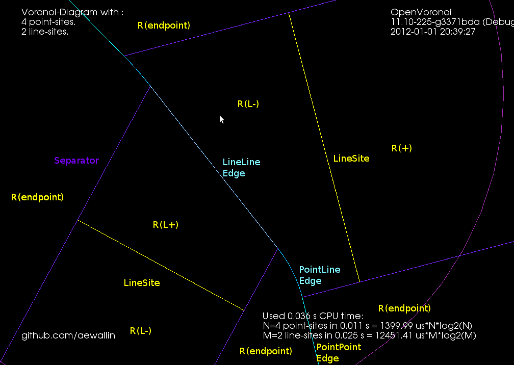
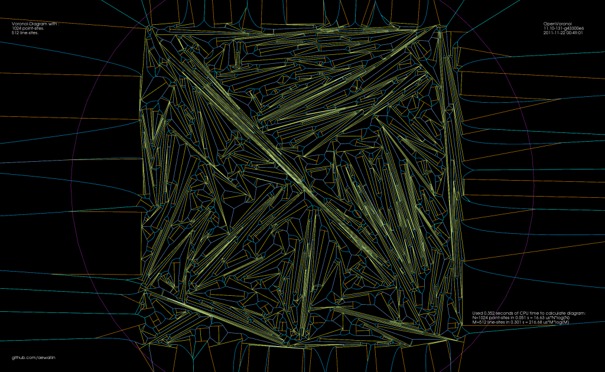
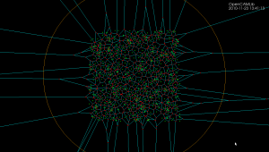

Total_pages = 
Per_page = 10


# 
Category: OpenVoronoi


```
sudo apt install libqd-dev

https://github.com/aewallin/openvoronoi

https://web.archive.org/web/20240623104307/https://www.anderswallin.net/category/cnc/cam/openvoronoi/
```


## FreeCAD V-carving with OpenVoronoi

```

https://web.archive.org/web/20240623104307/https://www.anderswallin.net/2019/05/freecad-v-carving-with-openvoronoi/

```


Sliptonic has worked on connecting FreeCAD with OpenVoronoi to produce V-carving (aka medial-axis) toolpaths.


```
https://web.archive.org/web/20240623104307/https://sliptonic.com/
https://web.archive.org/web/20240623104307/https://github.com/aewallin/openvoronoi
https://web.archive.org/web/20240623104307/https://en.wikipedia.org/wiki/Medial_axis


https://youtu.be/mC21T943auk
```


I worked on the OpenVoronoi stuff 7 years ago and we made this video back then:


https://www.youtube.com/watch?v=n4P9SvT4L7g


Page=2
## DXF Offset Pocketing loops


Some basic pocketing loops generated on the train today.

Using pycam's revise_directions() function it is possible to clean up the DXF data and classify polygons into pockets and islands.

There's a new parameter N_offsets


N_offsets=1 generates just a single offset at a specified offset-distance.

N_offsets=2... generates the specified number of offsets. Possibly with an increment in offset-distance that is not equal to the initial offset-distance. This happens e.g. when we want the final pass of the tool to be one cutter-radius from the input geometry but the material is difficult to machine and we want the "step-over" for interior offset-loops to be less than the cutter-radius.

N_offsets=-1 produces a complete interior pocketing path. Offsets are first generated at the initial offset distance and successive offsets are then generated at increasing offset distance until no offset-output is generated. 


Todo: Nesting, Linking, Optimization.


There's no nesting among the loops here. The algorithm will have no clue in what order to machine the offset loops. A naive approach is to machine all loops at the maximum offset distance, then move one loop outwards, etc. But this is clearly not good as the tool would jump between the growing pockets during machining. Nesting information should be straightforward to extract from the voronoi diagram during offset-generation. The nested loops form a tree/graph, which we traverse in some suitable order to machine the entire pocket. 


Also, there is no linking of these loops to eachother. For a machining toolpath one wants to link the offsets to each other so that the tool can be kept down in the material when we move from one offset loop to the next. A simple algorithm for linking should be straightforward, but I suspect something more involved is required to prevent overcutting with sufficiently complex input geometry.

When one has nested and linked offset paths, in general there still will remain "pen-up", "rapid traverse", "pen down" transitions. An asymmetric TSP solver could be run on this to minimize the rapid traverse distance (machining time).


### Pycam with openvoronoi

```
https://web.archive.org/web/20240623104307/https://www.anderswallin.net/2012/07/pycam-with-openvoronoi/

```


A very early result with trying to use openvoronoi from pycam:


Pycam reads the geometry from a DXF file, does some pre-processing of the geometry, pushes it over to openvoronoi which computes a VD and the offsets. Offsets (line-segments and arcs) are then communicated back to pycam for display and g-code generation.


### Random points VD benchmark

```
https://web.archive.org/web/20240623104307/https://www.anderswallin.net/2012/04/random-points-vd-benchmark/


https://web.archive.org/web/20240623104307/http://en.wikipedia.org/wiki/Voronoi_diagram
https://web.archive.org/web/20240623104307/http://en.wikipedia.org/wiki/Delaunay_triangulation


https://web.archive.org/web/20240623104307/https://github.com/aewallin/openvoronoi

https://web.archive.org/web/20240623104307/http://dx.doi.org/10.1142/S0218195994000124
https://web.archive.org/web/20240623104307/http://www.cosy.sbg.ac.at/~held/projects/vroni/vroni.html
https://web.archive.org/web/20240623104307/http://crd-legacy.lbl.gov/~dhbailey/mpdist/


https://web.archive.org/web/20240623104307/http://svn.boost.org/svn/boost/sandbox/gtl/doc/voronoi_main.htm
https://web.archive.org/web/20240623104307/http://ect.bell-labs.com/who/sjf/
https://web.archive.org/web/20240623104307/http://www.cgal.org/philosophy.html


```


Here's some benchmark data for constructing the Voronoi diagram (or its dual, the Delaunay triangulation) for random point sites. Code for this benchmark is over here: https://github.com/aewallin/voronoi-benchmark


OpenVoronoi is my own effort using the incremental topology-oriented algorithm of Sugihara&Iri and Held. Floating-point coordinates with all sites falling within the unit-circle are used. Fast double-precision arithmetic is used for geometric predicates (e.g. "in-circle") during the incremental construction of the diagram, since the topology-oriented approach ensures that the algorithm finishes and produces an output graph regardless of errors in the geometric predicates. Quad-precision arithmetic is used for positioning vd-vertices. This benchmark runs in ca 7us*N*log2(N) time.


Boost.Polygon uses Fortune's sweepline algorithm. Only integer input coordinates are allowed, which ensures that geometric predicates can be computed exactly. Lazy arithmetic, where a high-precision slower number-type is used only when required, is used. This benchmark runs in ca 0.2us*N*log2(N) time.

CGAL uses exact geometric computation, which is slow but supposedly robust. The run-time gets worse with increasing problem-size and doesn't seem to fall on an O(N*log(N)) line.


Some thoughts:


```
https://web.archive.org/web/20240623104307/http://www.boost.org/doc/libs/1_49_0/libs/graph/doc/index.html
https://web.archive.org/web/20240623104307/http://www.cs.cmu.edu/~quake/triangle.html
https://web.archive.org/web/20240623104307/http://www.qhull.org/
https://web.archive.org/web/20240623104307/http://www.cosy.sbg.ac.at/~held/projects/vroni/vroni.html
https://web.archive.org/web/20240623104307/http://www.flipcode.com/archives/The_Half-Edge_Data_Structure.shtml

```

OpenVoronoi is obviously too slow! Lazy arithmetic or other methods are required so that most vd-vertices can be positioned with fast double-precision code, and the quad-precision methods need to be called only rarely. OpenVoronoi uses a BGL adjacency_list to store the graph - this may also be too slow compared to a C-style "raw" data structure.


Other libraries which might be added to the benchmark: Triangle and QHull.

Held has, IIRC, reported around 0.5us*N*log2(N) for his closed-source VRONI algorithm. From the interwebs we also find this quote: "If your use is commercial, VRONI's license is a few thousand dollars."

It's easy to measure run-time, but how do we measure the correctness of the output that these algorithms produce? A first simple approach is write the output to a PNG or SVG file and visually inspect it, but something more precise and automated would be nice.

Neither Boost.Polygon nor OpenVoronoi support circular arc sites yet. Both can in principle be extended to do so.

Are we comparing apples to oranges? Is the output of these algorithms the same? OpenVoronoi produces a half-edge data structure of the diagram with edge-parametrizations (lines, parabolas) that allow computing a point on an edge at a given offset-distance from an adjacent site. The data structure allows for iterating through the edges, vertices, and faces of the graph.


```


```


### Arc predicates


```
https://web.archive.org/web/20240623104307/https://www.anderswallin.net/2012/04/arc-predicates/

```


I started working on arc-sites for OpenVoronoi. The first things required are an in_region(p) predicate and an apex_point(p) function. It is best to rapidly try out and visualize things in python/VTK first, before committing to slower coding and design in c++.

in_region(p) returns true if point p is inside the cone-of-influence of the arc site. Here the arc is defined by its start-point p1, end-point p2, center c, and a direction flag cw for indicating cw or ccw direction. This code will only work for arcs smaller than 180 degrees.


```
def arc_in_region(p1,p2,c,cw,p):
    if cw:
        return p.is_right(c,p1) and (not p.is_right(c,p2))
    else:
        return (not p.is_right(c,p1)) and p.is_right(c,p2)
```


Here randomly chosen points are shown green if they are in-region and pink if they are not.

apex_point(p) returns the closest point to p on the arc. When p is not in the cone-of-influence either the start- or end-point of the arc is returned. This is useful in OpenVoronoi for calculating the minimum distance from p to any point on the arc-site, since this is given by (p-apex_point(p)).norm().


```

def closer_endpoint(p1,p2,p):
    if (p1-p).norm() < (p2-p).norm():
        return p1
    else:
        return p2
 
def projection_point(p1,p2,c1,cw,p):
    if p==c1:
        return p1
    else:
        n = (p-c1)
        n.normalize()
        return c1 + (p1-c1).norm()*n
 
def apex_point(p1,p2,c1,cw,p):
    if arc_in_region(p1,p2,c1,cw,p):
        return projection_point(p1,p2,c1,cw,p)
    else:
        return closer_endpoint(p1,p2,p)
```


Here a line from a randomly chosen point p to its apex_point(p) has been drawn. Either the start- or end-point of the arc is the closest point to out-of-region points (pink), while a radially projected point on the arc-site is closest to in-region points (green).

The next thing required are working edge-parametrizations for the new type of voronoi-edges that will occur when we have arc-sites (arc/point, arc/line, and arc/arc).


### More Medial-Axis pocket milling

```
https://web.archive.org/web/20240623104307/https://www.anderswallin.net/2012/02/more-medial-axis-pocket-milling/

https://web.archive.org/web/20240623104307/http://www.anderswallin.net/2012/02/medial-axis-pocketing/
https://web.archive.org/web/20240623104307/http://en.wikipedia.org/wiki/Medial_axis
https://web.archive.org/web/20240623104307/http://en.wikipedia.org/wiki/Tree_(graph_theory)

```


My first attempt at MA-pocketing only worked when the medial axis of the pocket was a tree (a connected acyclig graph).


I've now extended this to work with pockets consisting of many parts which ha a MA consisting of multiple connected components. There's also simple support for when the MA has cycles, such as seen in "P" and "O" above. With a large cut-width the toolpath looks like this:


Each component of the pocket starts at the red dot with a pink spiral that clears the largest MIC of the pocket. The rest of the pocket is then "scooped out" using green cut-arcs connected with cyan (tool down) or magenta (tool up, at clearance height) rapid moves.


https://youtu.be/_Qr8tZXGXZU


Instead of clearing the interior of letters we can also clear a pocket around the letters. The MA then looks like this:


https://youtu.be/lfIU_gv0iB8


This video shows quite a lot of "air-cutting". This is because the algorithm only keeps track of the previously cleared area behind the MIC that is currently being cleared. When we come to the end of a cycle in the MA the algorithm does not know that in fact MICs in front of the current MIC have already been cleared.


### Medial-Axis pocketing

```
https://web.archive.org/web/20240623104307/https://www.anderswallin.net/2012/02/medial-axis-pocketing/

https://web.archive.org/web/20240623104307/http://www.google.fi/patents?hl=fi&lr=&vid=USPAT7831332

```


Update: In the US, where they are silly enough to have software-patents, there's US Patent number: 7831332, "Engagement Milling", Filing date: 29 May 2008, Issue date: 9 Nov 2010. By Inventors: Alan Diehl, Robert B. Patterson of SURFWARE, INC.


Any pocket milling strategy will have as input a step-over distance set at maybe 10 to 90% of the cutter diameter, depending on machine/material/cutter. Zigzag and offset pocketing paths mostly maintain this set step-over, but overload the cutter at sharp corners. Anyone who has tried to cnc-mill a hard material (steel) using a small cnc-mill will know about this. So we want a pocketing path that guarantees a maximum step-over value at all times. Using the medial-axis it is fairly straightforward to come up with a simple pocketing/clearing strategy that achieves this. There are probably many variations on this - the images/video below show only a simple variant I hacked together in 2-3 days.


The medial-axis (MA, blue) of a pocket (yellow) carries with it a clearance-disk radius value. If we place a circle with this radius on the medial-axis, no parts of the pocket boundary will fall within the circle. If we choose a point in the middle of an MA-edge the clearance-disk will touch the polygon at two points. If we choose an MA-vertex of degree three (where three MA-edges meet), the clearance-disk will touch the pocket at three points.


MA-pocketing starts by clearing the largest clearance-disk using a spiral path (pink).


From the maximum clearance-disk we then proceed to clear the rest of the pocket by making cuts along adjacent clearance-disks. We move forward along the MA-graph by an amount that ensures that the step-over width will never be exceeded. The algorithm loops through all clearance-disks and connects the arc-cuts together with bi-tangents, lead-out-arcs, rapids, and lead-in-arcs.


This video shows how it all works (watch in HD!). Here the cutter has 10mm diameter and the step-over is 3mm.


V_004.mp4


I'll try to make a variant of this for the case where we clear all stock around a central island next. These two variants will be needed for 3D z-terrace roughing. 


### Towards medial-axis pocketing

```
https://web.archive.org/web/20240623104307/https://www.anderswallin.net/2012/02/towards-medial-axis-pocketing/
```


Update: some work on connecting MICs together with bi-tangent line-segments, as well as a sequence of lead-out, rapid, lead-in, between successive MIC-slices:


It gets quite confusing with all cutting and non-cutting moves drawn in one image. The path starts with an Archimedean spiral (pink) that clears the initial largest MIC. We then proceed to "scoop" out the rest of the pocket with circular-arc cutting moves (green). At the end of a scoop we do a lead-out-arc (dark blue), followed by a linear rapid (cyan), and a lead-in-arc (light blue) to start the next scoop.


Next I'd like to put together an animation of this. The overall strategy will be much clearer from a movie.


https://youtu.be/CMNalKC2Rqc


This animation shows MICs, i.e. maximal inscribed circles (green, also called clearance-disks), inside a simple polygon (yellow). The largest MIC is shown in red.


This is work towards a new medial-axis pocketing strategy. The largest MIC (red) is first cleared using a spiral strategy. We then proceed to clear the rest of the pocket in the order that the MICs are drawn in the animation. We don't have to spin the tool around the whole circle. only the parts that need machining, which is the part of the new MIC that doesn't fall inside the previously machined MIC. As mentioned in my previous post this is inspired by Elber et al (2006). 


http://dx.doi.org/10.1016/j.cad.2004.05.008
https://web.archive.org/web/20240623104307/http://dx.doi.org/10.1016/j.cad.2009.04.002
https://web.archive.org/web/20240623104307/http://www.cosy.sbg.ac.at/~held/teaching/seminar/seminar_2010-11/hsm.pdf


The next step is to calculate how we should proceed from one MIC to the next, and how we do the rapid-traverse to re-position the tool for the next cut.


DAC05OffsetPolygon.pdf


```
https://stackoverflow.com/questions/31002815/how-can-i-create-an-internal-spiral-for-a-polygon

https://github.com/aewallin/openvoronoi/blob/master/README.rst

https://github.com/aewallin/openvoronoi/blob/master/TODO
```


See also the spiral-toolpath by Held&Spielberger; (2009) or their 199-slide presentation. The basics of this spiral-strategy is a straightforward march along the medial-axis. But then a filtering/fitting algorithm, which I don't have at hand right now, is applied to get the smoothed spiral-path.


### With FreeSerifBoldItalic, don't ever write "zj"!


```
https://web.archive.org/web/20240623104307/https://www.anderswallin.net/2012/01/with-freeserifbolditalic-dont-ever-write-zj/

https://web.archive.org/web/20240623104307/http://www.anderswallin.net/2012/01/non-smooth-output-from-ttt/


```


Update: Here is "VX" with FreeSerifItalic. There is overlap in LibreOffice also.


For the most part truetypetracer produces valid and nice input data for testing openvoronoi. But sometimes I see wiggles, and now this:


It is frustrating to try to track down bugs in downstream algorithms that take this as input, and assume all line-segments are non-intersecting when in fact the are not!


I seem to have only 13 .ttf files in my /usr/share/fonts/truetype/freefont folder, but maybe there are more elsewhere. I should find a font that is properly designed without wiggles and without overlaps. The other approach is to write a pre-processor that looks at input data and either rejects or cleans it. Looking for all pair-wise intersections of N line-segments is a slow N^2 algorithm - at least for a naive implementation (without bounding-boxes or binning or other tricks).

Unlike the wiggles, this overlap doesn't happen in Inkscape:


Here is G-code generated with ttt-4.0 and drawn in LinuxCNC:


Here is a screenshot from LibreOffice 3:


and GIMP:


### V-carving test

```
https://web.archive.org/web/20240623104307/https://www.anderswallin.net/2012/01/v-carving-test/
```


https://www.youtube.com/watch?v=n4P9SvT4L7g


A first try at v-carving, with toolpaths produced by the ttt2medial python script.


```
https://web.archive.org/web/20240623104307/https://github.com/aewallin/linuxcnc-scripts/blob/master/ttt2medial.py

https://github.com/aewallin/linuxcnc-scripts/
```


emc2_vcarve.jpg


PAGE= 10+ , 2


### Non-smooth output from ttt

```
https://web.archive.org/web/20241004021131/https://www.anderswallin.net/2012/01/non-smooth-output-from-ttt/


https://web.archive.org/web/20130816060024/https://www.anderswallin.net/category/cnc/cam/openvoronoi/page/2/

https://web.archive.org/web/20130811065450/http://kcachegrind.sourceforge.net/html/Home.html


https://web.archive.org/web/20160406170534/https://www.anderswallin.net/category/cnc/cam/openvoronoi/page/2/

```


I tried cranking up (10-fold) the number of line-segments that are used when approximating conics and cubics with lines. The results are mostly OK, but sometimes "wiggles" or "S-curves" appear, which cause problems for the medial-axis filter. This "P" is an example:


The medial axis on the right does not look correct. If we zoom in it's clear that there's an "S-curve" in the input geometry, which causes a LINELINE edge (drawn in darker blue), which the medial-axis filter doesn't think should be removed:


For the letters "EMC" it looks mostly OK, but there's a similar wiggle in "E"


Increasing the number of line-segments further causes even stranger things. Here's a zoom-in at the top of "P" that shows both the wiggle that was visible before, but also a strange inward bulge:


Hopefully this is a bug in how conics/cubics are converted to line-segments in ttt, and not an issue with how FreeType fonts are represented.


### EMC2 Filters

```

https://web.archive.org/web/20241004021131/https://www.anderswallin.net/2012/01/emc2-filters/

https://web.archive.org/web/20241004021131/https://github.com/aewallin/linuxcnc-scripts


https://web.archive.org/web/20241004021131/http://timeguy.com/cradek/truetype


https://web.archive.org/web/20241004021131/https://github.com/aewallin/linuxcnc-scripts

https://web.archive.org/web/20241004021131/http://en.wikipedia.org/wiki/Voronoi_diagram

```

I hacked together a few python-scripts that can be run as "filters" in EMC2. They are opened/run from AXIS and produce G-code into EMC2.


The first one is ttt2ngc which simply demonstrates my C++ port of Chris Radek's truetype-tracer. The original code is a rather monolithic C-program while my C++ port is divided into smaller files and offers python-bindings and more options (for example arc, cubic, conic output can be turned on/off independently).


The seconds script is ttt2offset which takes ttt-geometry, builds a VD, and produces offsets. By reversing the list of points from ttt either inwards or outwards offsets can be produced. Currently the toolpaths are machined in the order they are produced, i.e. in order of increasing offset value. An improvement would be to order the loops so that for e.g. pocketing the innermost loop is machined first, and rapid-traverses are minimized.


The third script is ttt2medial. Here the VD is filtered down to an (approximate) medial-axis, and the edges of the medial axis are chained together into a toolpath. The chaining-algorithm could probably be improved much, again to minimize rapid-traverses.


https://web.archive.org/web/20241004021131/https://github.com/aewallin/linuxcnc-scripts

https://web.archive.org/web/20241004021131/http://en.wikipedia.org/wiki/Medial_axis


If this is run with a V-shaped cutter with a 90-degree angle we can push the cutter into the material by an amount equal to the clearance-disk radius of the edge. This is a "V-carving" toolpath which should produce a cut-out very similar to the outline of the font. For added effect choose a material with  contrasting surface and interior colors.


It would be interesting to know if this v-carving g-code is anywhere near to correct. If someone has a cutting-simulator, or is adventurous enough to run this on an actual machine, I'd be very interested in the results! (here is the g-code: emc2_vcarve.ngc)


https://web.archive.org/web/20241004021131/http://www.anderswallin.net/wp-content/uploads/2012/01/emc2_vcarve.ngc_.zip


Here is a metric version. The max depth is around -3mm, so a 10mm diameter 90-degree V-cutter should be OK. The text should be roughly 100mm long: emc2_vcarve_mm_ver2.ngc


https://web.archive.org/web/20241004021131/http://www.anderswallin.net/wp-content/uploads/2012/01/emc2_vcarve.ngc_.zip
https://web.archive.org/web/20241004021131/http://www.anderswallin.net/wp-content/uploads/2012/01/emc2_vcarve_mm_ver2.ngc_.zip


Disclaimer: This is experimental code. Warnings, Errors, and Segfaults are common.


Both files are missed?


### Graph filters

```
https://web.archive.org/web/20241004021131/https://www.anderswallin.net/2012/01/graph-filters/
https://web.archive.org/web/20241004021131/http://en.wikipedia.org/wiki/Voronoi_diagram
```


The first one detects the interior or exterior of a polygon. When the VD is constructed the polygon boundary must be input in CW order, and any islands inside the polygon in CCW order (or vice versa). This allows running other downstream algorithms only on the parts of the VD that pass the filter. Like these exterior and interior offsets:


The other filter looks at the interior VD and tries to produce an approximate medial axis. We can start with the complete interior VD, such as this "J":


https://web.archive.org/web/20241004021131/http://en.wikipedia.org/wiki/Medial_axis


By definition the medial axis consists of "the set of all points having more than one closest point on the object's boundary". The separator edges shown in purple above can clearly be eliminated, since their adjacent/defining sites are an open line-segment and the segment's endpoint. Removing separators gives us this:


Now we can either finish here, or try to filter out some more edges to make it look better. Since we approximated smooth curves with line-segments we should try to detect which parts of the boundary are really distinct curves, and which are merely many consecutive line-segments approximating a single smooth curve. I've compared the dot-product (angle) between two consecutive segments, and applied an arbitrary threshold:


For the whole alphabet it looks like this.


The choice of threshold value for the angle-filtering is arbitrary. In many cases such as "x" and "m" it results in small or large left-over branches. This could probably be avoided by (1) tuning the angle-threshold, (2) approximating smooth curves with a larger number of line-segments, (3) eliminating branches below a certain length, or (4) choosing a font that's made for v-carving (are there any?).


Although it's probably not right to call it a "medial axis" , the same filter applied to the exterior VD also looks interesting. It divides the plane into organic looking shapes around each letter. It could probably be used for a lot of shape analysis. For example in a smart pocketing routine to find large areas that can be cleared with a large cutter, before a smaller cutter is required for the details. Note that in addition to the geometric shape of all the blue-ish edges the diagram also holds distance-information at each point of an edge. The distance stored is a clearance-disk radius, i.e. we can draw a circle at any point of an edge with this radius, and no input geometry (in yellow) will intersect the circle.


### 2D Offsets

```
https://web.archive.org/web/20241004021131/https://www.anderswallin.net/2012/01/2d-offsets/
```


Once we have a VD it is almost trivial to calculate 2D offsets. While the VD for n line-segments takes O(n*log(n)) time to calculate, the offset-generation is a simple "march" that takes O(n) time. In this "A" example it takes 24 milliseconds to calculate the VD and less than 1 millisecond to produce all the shown offsets. Input geometry in yellow, VD in blue. Offset lines in light-green and offset arcs in slightly darker green.


Here is a larger example where VD takes 1.3 seconds, and all offsets shown take 99 milliseconds in total to produce. It would be interesting to benchmark this against libarea or other open-source 2D offset solutions. (here all line/arc offsets in one green color, for simplicity)


https://web.archive.org/web/20241004021131/https://github.com/Heeks/libarea


https://web.archive.org/web/20240929215941/https://www.anderswallin.net/wp-content/uploads/2012/01/offset2.png


Here is a third picture with offsets for a single offset-distance:


### VD Alphabet


```
https://web.archive.org/web/20241004021131/https://www.anderswallin.net/2012/01/vd-alphabet/

```


There was an issue with handling collinear line-segments, which is hopefully now fixed. OpenVoronoi seems to deal OK with most characters from ttt now.

I am still getting some Warnings about numerical instability from LLLSolver, possibly related to these high-degree vertices which don't look quite right (this is a zoom-in inside the circular dot of "j" in the picture above):


https://web.archive.org/web/20241004021131/http://en.wikipedia.org/wiki/Medial_axis


I should write a class for extracting offsets next. Then perhaps medial axis (if anyone is interested in v-carving toolpaths).


### TTT++ and font-vd


```
https://web.archive.org/web/20241004021131/https://www.anderswallin.net/2012/01/ttt-and-font-vd/
https://web.archive.org/web/20241004021131/http://www.timeguy.com/cradek/truetype
https://web.archive.org/web/20241004021131/http://www.freetype.org/
```


Update: Now all the capital letters work!


I wanted to test my VD algorithm on font-outlines. So I ported Chris Radek's truetype-tracer to c++ and added some python bindings. Here: https://github.com/aewallin/truetype-tracer


Because my VD code cannot handle circular arcs yet, I took some old code from TTT 3.0 and made converting conics and cubics, the native output of FreeType, as well as arcs into line-segments optional.

Predictably, OpenVoronoi crashes in many cases, but here is an "L" that works:


### VD for polylines and polygons

```
https://web.archive.org/web/20241004021131/https://www.anderswallin.net/2012/01/vd-for-polylines-and-polygons/
https://web.archive.org/web/20241004021131/https://github.com/aewallin/openvoronoi

https://web.archive.org/web/20241004021131/http://www.anderswallin.net/2011/11/random-line-segment-voronoi-diagram/


```


I've been hacking away at openvoronoi, adding support for polylines and polygons.

The code I had in November works with individual non-intersecting line segments, like this:


Note how each vertex in the figure above is of degree three, i.e. there are three edges incident on each vertex. There's something about the number three, or triangles, or both, that makes planar graphs of degree three particularly nice to work with.


https://web.archive.org/web/20241004021131/http://en.wikipedia.org/wiki/Planar_graph

https://web.archive.org/web/20241004021131/http://en.wikipedia.org/wiki/Degree_(graph_theory)


Here's the same figure with some notes describing the elements. The line-sites are drawn in yellow, and are associated with their left R(L+) and right R(L-) regions. The purple lines are called separators, and they define the region associated with the start- or end-point of a line-site. The three possible edge-types are also shown: LineEdge between two point-sites, LineEdge between two line-sites, and a Parabolic (PointLine) edge between a point-site and a line-site.





Now, things get more complicated when we want to 'glue' two line-segments end-to-end in a polyline, or glue three or more line-segments together to form a polygon. Vertices are not necessarily of degree three any more. In fact the vertex degree is essentially unbounded, as you can start/end arbitrarily many line-segments at the same vertex. The solution I am using is to introduce what I call a null-face with zero-length null-edges around each point-site to which more than one line-segment connects. The mental picture is much like that of a key-chain, or mountaineering carabiners that are hooked-in to a loop. When we want to use the a vertex as a start/end-point for a segment we 'hook-in' to the null-face:


This introduces a number of new rules and associated code for how vertices should be created, removed, and moved around a null-face, but it seems to work somehow now:


Note how these null-faces and the circular null-edges around each end-point result in degree three vertices, which are much nicer to deal with in the algorithm. For example, the null-face around vertex "0" is 40->85->86->41->39. Without the null-face construction this vertex would be of degree five. Here is an annotated version of the same picture:


This image shows how the diagram divides the plane into regions associated with endpoints such as R(0) and with the right/left side of a line-segment such as R(0-29) and R(29-0). The null-edges that form null-faces around each end-point are drawn in white.

Of course, these null-edges are only a topological construction. Geometrically we can position each vertex on a null-face at the location of the encircled point-site. This effectively contracts away the zero-area null-faces, and the result is the diagram we want:


The code now runs for a few select test-cases. To be continued...


Update: The code now seems to work also for random polygons with a large number of vertices. Here is one with 400 vertices:


 and 3200-vertices:


### Call graph


```
https://web.archive.org/web/20241004021131/https://www.anderswallin.net/2011/12/call-graph/

```


For profiling I made a small c++ program which calculates a poisson voronoi diagram. When called through valgrind like this (under valgrind the program will run roughly 50 times slower than normal)
valgrind --tool=callgrind -v ./ovd_tst --n 1000
I can then use kcachegrind to draw a call graph.

I thought the nearest-neighbor grid-search (grid_find_closest_face()) would cost much more than it does. 


https://web.archive.org/web/20241004021131/http://valgrind.org/
https://web.archive.org/web/20241004021131/http://kcachegrind.sourceforge.net/html/Home.html

https://web.archive.org/web/20241004021131/http://en.wikipedia.org/wiki/Nearest_neighbor_search


The callee map may in fact better visualize where CPU time is spent:


The map changes significantly if we change the solver number type to double, which is faster but less accurate. A better strategy might be to run the fast solver(double) first, then check the quality of the solution, and run the slow solver(qd_real) only if necessary.


In this map there doesn't seem to be an obvious bottleneck or 'hot spot' in immediate need of optimizing, since there are 6-8 blocks/functions each taking roughly 10% of the CPU time.

After some tweaking the benchmark (with the double solver) run gives these results:


### Poisson Voronoi diagram statistics


```
https://web.archive.org/web/20241004021131/https://www.anderswallin.net/2011/12/poisson-voronoi-diagram-statistics/
```


On g+, John Baez linked to work by Henk Hilhorst on the probability of finding voronoi cells with n sides in a poisson voronoi diagram.


A poisson voronoi diagram has point sites randomly and uniformly distributed, like this:


Here's the distribution I came up with, after counting the edges for each voronoi cell from 200 runs where openvoronoi generated the diagram for 100k point-sites in each run. The green line is Hilhorst's prediction. I'm assuming poisson statistics, so if the bin-count for a certain n is fn, I've drawn errorbars of length sqrt(fn). Cells with n=15 or n=16 are so rare that the statistical error is of the same size as the probability (but it does agree with Hilhorst's prediction). Among the 20M cells I looked at I did not find n >= 17. For n=17 the predicted probability is 2e-9, so there's should be a 50% chance of seeing one if I would produce 500M random cells (that would take about 7 hours of CPU time).


https://web.archive.org/web/20241004021131/https://github.com/aewallin/openvoronoi
https://web.archive.org/web/20241004021131/http://dx.doi.org/10.1088/1751-8113/40/11/002


The relevant papers are


http://arxiv.org/abs/cond-mat/0507567 "Asymptotic statistics of the n-sided planar Poisson-Voronoi cell: I. Exact results", Journal of Statistical Mechanics: Theory and Experiment -- (2005) P09005

http://arxiv.org/abs/0903.3466 "Asymptotic statistics of the n-sided planar Voronoi cell: II. Heuristics", Journal of Statistical Mechanics: Theory and Experiment -- (2009) P05007

http://arxiv.org/abs/0709.0347 Statistical properties of planar Voronoi tessellations

http://dx.doi.org/10.1088/1751-8113/40/11/002 New Monte Carlo method for planar Poisson–Voronoi cells


The logarithmic y-axis hides the fact that the distribution is very peaked around n=6, so here is a plot with a linear y-axis:


### Random line-segment voronoi diagram

```
https://web.archive.org/web/20241004021131/https://www.anderswallin.net/2011/11/random-line-segment-voronoi-diagram/
```


Update3: version 11.10-148 now goes to 16k line-sites without errors or warnings:


Update2: This diagram with 8k vertices clearly has errors:


Update: Version 11.10-141 now copes with 4k random segments. But I don't know of any smart way to check the diagram for correctness..


Constructing the vd for random (non-crossing) line-segments is a reasonable stress-test for my vd-algorithm. When you've fixed one bug, just increase the number of line-segments by a factor of two and you will most likely uncover another! It now runs OK up to 2048 line-segments (yes, that does imply I get a segfault at 4096!).

There's some slowdown from 5us*n*log(n) in september 2011 (for just point-sites), to this code which runs in about 15 to 20us*n*log(n) when inserting the point-sites. Line-sites take longer, about 200us*m*log(m) for m line-sites.


https://web.archive.org/web/20241004021131/http://www.anderswallin.net/2011/09/vd-benchmark/





### Category: OpenVoronoi  PAGE : 4


**Voronoi diagram error**


```
https://web.archive.org/web/20241004021004/https://www.anderswallin.net/2011/02/voronoi-diagram-error/

https://web.archive.org/web/20241004021004/http://www.anderswallin.net/2010/11/voronoi-diagram-algorithm/


```


Playing around with the vd-code has highlighted some problems. Using double-precision floating point numbers for coordinates, strange things start to appear when the coordinates are around 1E-6 or so. It's not possible to accurately compute the sign of the in-circle predicate (a 4x4 determinant) and the diagram update should instead be based on topological reasoning.


**Delaunay Triangulation**


```
https://web.archive.org/web/20241004021004/https://www.anderswallin.net/2011/01/delaunay-triangulation/

```

The dual of the Voronoi diagram is the Delaunay triangulation. Here I've modified my earlier VD code to also output the dual (shown in red). If this can be developed further to do constrained Delaunay triangulations (arbitrary pockets with islands) then it will be useful for cutter-location surfaces in opencamlib.

The regular grid is, in the words of the GTS website, "a much more difficult test than it looks".


https://youtu.be/dXyyccLi1X8


**Voronoi diagram algorithm**


Update: now seems to work for at least 10k generators:


 and a zoom-in of the same picture:


One way to compute 2D offsets for toolpath generation is via the voronoi diagram. This video shows the first (somehow) working implementation of my code, which is based on papers by Sugihara and Iri. Their 1992 paper is here: http://dx.doi.org/10.1109/5.163412, then a longer 50-page paper from 1994 here: http://dx.doi.org/10.1142/S0218195994000124, and then there's a more general description of the topology-based approach from 1999 here 10.1007/3-540-46632-0_36, and from 2000 here: http://dx.doi.org/10.1007/s004530010002


```
https://web.archive.org/web/20241004021004/http://en.wikipedia.org/wiki/Voronoi_diagram

```


The algorithm works by incrementally constructing the diagram while adding the point-generators one by one. This initial configuration is used at the beginning:


The diagram will be correct if new generator points are placed inside the orange circle (this way we avoid edges that extend to infinity). Once about 500 randomly chosen points are added the diagram looks like this:





Because of floating-point errors it gets harder to construct the correct diagram when more and more points are added. My code now crashes at slightly more than 500 generators (due to an assert() that fails, not a segfault - yay!). It boils down to calculating the sign of a 4-by-4 determinant, which due to floating-point error goes wrong at some point. That's why the Sugihara-Iri algorithm is based on strictly preserving the correct topology of the diagram, and in fact they show in their papers that their algorithm doesn't crash when a random error is added to the determinant-calculations, and it even works (in some sense) when the determinant calculation is completely replaced by a random number generator. Their 1992 paper constructs the diagram for one million generators using 32-bit float
numbers, while my naive attempt using double here crashes after 535 points... some work to do still then!


https://web.archive.org/web/20241004021004/http://en.wikipedia.org/wiki/Floating_point#Accuracy_problems


CAM toolpaths tend to be based on CAD-geometry in the form of lines, circular arcs, or spline-curves and such. One way forward is to think of a curve as a lot of closely spaced points along the curve. There are also papers which describe how to extend the algorithm for line and arc generators. See the 1996 paper by Imai. There is FORTRAN code for this by Imai over here (I haven't looked at it or tried compiling it...). Held et al. describe voronoi diagram generation for points and lines in 2001: http://dx.doi.org/10.1016/S0925-7721(01)00003-7 and for points, lines, and arcs in 2009 http://dx.doi.org/10.1016/j.cad.2008.08.004.  This pic from the Held&Huber 2009 paper shows point, line, and arc generators in bold-black, the associated voronoi-diagram as solid lines, and offsets as grey lines.


Held has more pictures here: http://www.cosy.sbg.ac.at/~held/projects/pocket_off/pocket.html

Note how within one voronoi-region the offset is determined by the associated generator (a line, point, or arc). It's very easy to figure out the offset within one region: points and arcs have circular offsets, while lines have line offsets. The complete offset path is a result of connecting the offset from one region with the next region.


