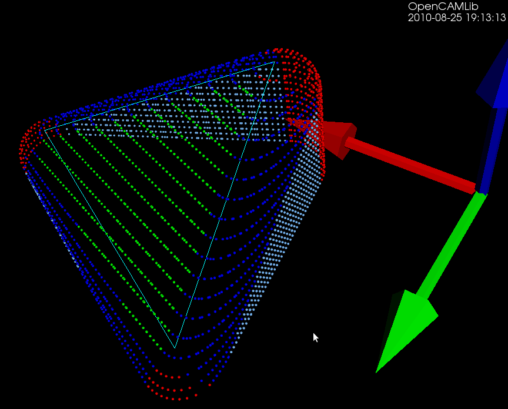
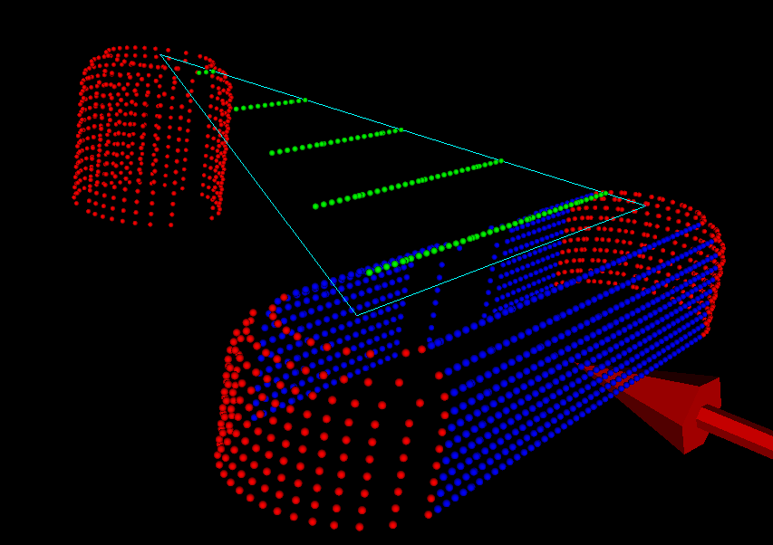

## Waterline

```
https://web.archive.org/web/20240725012254/https://www.anderswallin.net/category/cnc/cam/waterline-cam/
```


**Comparing waterlines**

```
https://web.archive.org/web/20241006193840/http://www.anderswallin.net/2011/07/comparing-waterlines/
```


Here's a picture which compares the waterline toolpath for different cutters around a single triangle (cyan). The outermost path (red) is for a cylindrical cutter where we always make contact with either the shaft of the cutter or the circular rim/end of the cutter. Next is the yellow line for the toroidal or BullCutter, followed by the green line for a spherical or BallCutter. The innermost waterline (pink) is for a conical ConeCutter.


Here are some more waterlines at different heights. This exercise has uncovered at least two new bugs with CylCutter and ConeCutter! The CylCutter seems to fail when asking for a waterline at z=0.0, so that might hint at where the problem is. I'm not sure what is causing the jagged shape with ConeCutter.


Update: The cl-points for conecutter look right, so there must be something strange going on with the weave??


**Cone-cutter waterlines**

```
https://web.archive.org/web/20241006193840/http://www.anderswallin.net/2011/07/cone-cutter-waterlines/

```


I'm not sure why it has taken so long to get the push-cutter methods for ConeCutter written. You would think that the cylindrical, spherical, or toroidal cases are at least as hard. Somehow I have just avoided working on the cone-cutter...

The easy part is as usual contacts between the cutter and the vertices of a triangle - these are shown as red dots. Contact with the facet of the triangle can be made in two ways (1) by the tip of the cone, or (2) by the circular base of the cone, when the facet is steeper than the cone. These are shown in green.

The more involved case is contacts with the edge of the triangle. There are again two cases: We can make contact with the circular base of the cone (cyan dots), or we can make contact with the actual conical part of the cutter (pink dots).


Here is an animation that gives the code a workout. Note how the color of the contact-points changes depending both on what part of the triangle we are making contact with and on what part of the cutter is making the contact.


https://youtu.be/yguU237xdDw

https://web.archive.org/web/20241006193840/https://github.com/aewallin

I have now used github for a while, and will probably merge the conecutter feature-branch into master very soon. Almost as soon as I tried github google-code also started supporting git, but possibly the forking and social aspects of github make a switch worthwhile anyway.

There are some interesting developments on the higher level Waterline/Weave algorithm also, which will reduce the memory-consumption of the algorithm from N*N to N+N (where N is the number of Fibers). This will hopefully make Waterline more useful as now many people have been running out of RAM or just seen sudden crashes. Stay tuned...


**The weave point-order problem**


When creating waterlines or 2D offsets using a "sampling" or "CL-point based" approach the result is a grid or weave such as that shown in black above. The black lines can in principle be unevenly spaced, and don't necessarily have to be aligned with the X/Y-axis. The desired output of the operation is shown in red/orage, i.e. a loop around/inside this weave/grid, which connects all the "loose ends" of the graph.

My first approach was to start at any CL-vertex and do a breadth_first_search from there to find the closest neighboring vertices. If there are many candidates equally close you then need to decide where to jump forward, and do the next breadth_first_search. This is not very efficient, since breadth_first_search runs a lot of times (you could stop the search at a depth or 5-6 to make it faster).


The other idea I had was some kind of 'surface tension', or edge removal/relaxation where you would start at an arbitrary point deep inside the black portion of the graph and work your way to the outside as far as possible to find the output. I haven't implemented this so I'm not sure if it will work.

What's the best/fastest way of finding the output? Comments ?!

Update: I am now solving this by first creating a planar embedding of the graph and then running planar_face_traversal with a visitor that records in which order the CL-points were visited. The initial results look good:


https://web.archive.org/web/20240916021844/http://www.boost.org/doc/libs/1_43_0/libs/graph/doc/planar_face_traversal.html


 4 thoughts on “The weave point-order problem”


**Weave notes**

Louis says:	
August 3, 2010 at 22:40	

If you know the xy coords of each vertex then it seems quite stright forward. Is that the case? If not then it's a lot more interesing. I think there's a neat algorithm, that starts with discs on each deg 1 vxt and moves each of them to their adjacent vtx, checks to see if any meet L or R neighbours, then moves discs fwd if there's more than 1 at the vertex, all the time watching out for discs that meet again (just kill then off, but maybe leave a gaurd there). Sorry it's not very clear, just off the top of my head.
Regards, Lou.


Administrator says:	
August 3, 2010 at 22:52	

the (x,y) coordinates for all the vertices are known (the black lines in the pic). But they are completely unordered, so you don't know between which two vertices to insert the red edges.

in the boost graph-library, theres a Planar Face Traversal algorithm which I will try next.
http://www.boost.org/doc/libs/1_35_0/libs/graph/doc/planar_face_traversal.html


```
https://web.archive.org/web/20241006193840/http://www.anderswallin.net/2011/05/weave-notes/
https://web.archive.org/web/20241006193840/http://www.anderswallin.net/2010/08/the-weave-point-order-problem/

```


As noted before, the waterline operation consists of radial cutter projection ("push cutter") along fibers/dexels, followed by a weave/grid construction, and contouring to produce the final toolpath. Like so:


The new Weave2 class builds up a half-edge diagram in a smart way, maintaining "next" and "previous" pointers for each edge, so that the green toolpath loop can easily be found by traversing from one CL-point to the next simply following the "next" pointer:


https://web.archive.org/web/20241006193840/http://www.cgal.org/Manual/latest/doc_html/cgal_manual/HalfedgeDS/Chapter_main.html


(The magenta arrows are "next" pointers which point from one edge to the next)

The main part of the algorithm looks at one X-fiber (from xL to xU) and one Y-fiber (from yL to yU) at a time and inserts a new internal vertex (v) into the diagram, while maintaining the existing "next" and "prev" pointers.


I didn't come up with any elegant object-oriented scheme that would do this nicely, so the build() function in the code just peeks and pokes and updates all of the 24 pointers in a brute-force kind of style.

I suspect that the O(n^2) time-complexity is optimal, since with n X-fibers and n Y-fibers there will be roughly n*ninternal vertices in the grid, and they all have to be processed (?unless we can prune the grid and ignore internal areas and focus on the edge of the weave?).


https://web.archive.org/web/20241006193840/http://code.google.com/p/opencamlib/source/browse/trunk/src/algo/weave2.cpp


**Faster Waterline**


```
https://web.archive.org/web/20241006193840/http://www.anderswallin.net/2011/05/faster-waterline/
https://web.archive.org/web/20241006193840/http://code.google.com/p/opencamlib/


```


I've written a new Weave class for opencamlib which makes the waterline operation faster.

The first test-case is a single triangle, and we calculate a number of waterlines at different z-heights using a ball-cutter:


The second test-case is the Tux model where we calculate a single waterline at some z-height. Note how using the chosen ball-cutter at this particular height the waterline splits into two separate loops.


(the yellow line is a plain waterline and the red line is an adaptive Waterline, but that's not important here)

Here is the runtime data. The smaller symbols show results from the one-triangle test-case. The old algorithm(red data points and line) seems to be slower than O(N^2), with a pre-factor of about 2 milliseconds. The time data for the new algorithm (green) fits an O(N^2) line better and has an almost 10-fold faster pre-factor of around 0.25 ms.

The speedup for the Tux model (large symbols) is even greater. With the old algorithm the slope of the data points (pink) looks much worse than N^2 and runtimes quickly reach a minute or more. With the new algorithm (big light green symbols) the runtime stays under 100s even at 200 fibers/mm.


https://web.archive.org/web/20241006193840/http://www.anderswallin.net/2010/11/better-adaptive-waterline/


This speedup was achieved by building a weave which is a directed half-edge graph, instead of the old undirected graph. The old algorithm first used connected_components (time complexity O(V + E)) to split the weave into its connected components. For each component a planar embedding was then constructed (time complexity ??), and the toolpath loop extracted with planar_face_traversal (time complexity O(V+E)).


https://web.archive.org/web/20241006193840/http://www.boost.org/doc/libs/1_46_1/libs/graph/doc/connected_components.html

https://web.archive.org/web/20241006193840/http://www.boost.org/doc/libs/1_46_1/libs/graph/doc/planar_face_traversal.html


In the new Weave, each edge has a "next" pointer pointing to the next edge of the face. This means we can extract the toolpath loop by following the "next" pointer until we find the next CL-point. Effectively the planar embedding is now contained in the graph datastructure and does not have to be computed separately. This also saves work since we don't have to traverse faces which do not produce toolpaths. This new solution to the weave point-order problemdeserves its own post in the near future - stay tuned...


https://web.archive.org/web/20241006193840/http://www.anderswallin.net/2010/08/the-weave-point-order-problem/


**Waterline fix**


```
https://web.archive.org/web/20241006193840/http://www.anderswallin.net/2011/02/waterline-fix/


```


In the general edge-push function there was a guard against horizontal edges, since they are supposed to be handled by a special horizontalEdgePush() function. But there was no check for vertical edges. They are special too, and caused the rather strange looking behavior with BallCutter seen below.


With BullCutter the code stopped at an assert() and there was no toolpath output at all.

This is now hopefully fixed and we simply give up and return in generalEdgePush() if we encounter a horizontal or a vertical edge. These should be handled upstream by simpler specialized functions. Never assume general position is the take home message I guess...


https://web.archive.org/web/20241006193840/http://en.wikipedia.org/wiki/General_position


**Better adaptive waterline**


```
https://web.archive.org/web/20241006193840/http://www.anderswallin.net/2010/11/better-adaptive-waterline/


https://web.archive.org/web/20241006193840/http://www.anderswallin.net/2010/11/waterline-problem/

```


Previously the flat() predicate looked only at the number of intervals contained in a fiber when deciding where to insert new fibers in the adaptive waterline algorithm. Here I've borrowed the same flat() function used in adaptive drop-cutter which computes the angle between subsequent line-segments(yellow), and inserts a new fiber(cyan) if the angle exceeds some pre-set threshold.


This works on the larger Tux model also. However, there's no free lunch: the uniformly sampled waterline (yellow) runs in about 2 s (using OpenMP on a dual-core machine), while the adaptively sampled waterline takes around 30s to compute (no OpenMP).


https://web.archive.org/web/20241006193840/http://www.anderswallin.net/2010/10/adaptive-sampling-drop-cutter/


**Waterline problem**


```
https://web.archive.org/web/20241006193840/http://www.anderswallin.net/2010/11/waterline-problem/

https://web.archive.org/web/20241006193840/http://www.anderswallin.net/2010/10/adaptive-sampling-drop-cutter/

```


I was trying to work on a new adaptive waterline feature, but ended up uncovering an old existing problem/bug with waterline. I think it has to be a problem in either building the weave from the fibers, or constructing the planar embedding of the weave.


The yellow waterline should obviously be a smooth loop around the outside of the weave (red/green fibers) and not a zigzag journey back and forth... 🙁

Update: this is better now:


Update2: here's a figure where new fibers (red and green) are inserted adaptively where the shape of the waterline changes most. There's something wrong with building the planar embedding for this weave, so no yellow adaptive waterline path yet...


Update3: some progress at last (fixed a bug in adaptive drop-cutter at the same time):


**waterline with bullcutter**

```
https://web.archive.org/web/20241006193840/http://www.anderswallin.net/2010/10/waterline-with-bullcutter/
```


Update: Here is another example with the CL-points coloured differently. At each z-height the innermost loop is with the ball-cutter, next is the bullcutter, and the outermost loop is calculated for a cylindrical cutter. The points are coloured based on which test (vertex, facet, edge) produced them. Vertex-test points are red. Facet-test points are green. The edge-test is further subdivided into (1) a test for horizontal edges (orange), (2) a test for contact with the cylindrical shaft of the cutter (magenta), and (3) the general edge-push function (light blue for ball/bull, pink for cyl). If/when I get the cone-cutter done the cutter-location algorithms in opencamlib should be complete (at least for the moment...), and I can move on to more interesting high-level algorithms.


This figure shows one of the first times I got the push-cutter/waterline algorithm working for bullcutter (filleted endmill, bull-nose cutter, toroidal cutter, a dear child has many names...).

The thin cyan lines are edges of a triangle. The outer cyan spheres are valid cutter locations (CL-points) for a cylindrical endmill. The innermost yellow CL-points are for a spherical (or ball-nose) endmill. Between these two point-sets the new development is the magenta points, which are CL-points for a bull-nose cutter.


https://web.archive.org/web/20241006193840/http://www.freesteel.co.uk/wpblog/


he algorithm works by pushing the cutter at a specified Z-height along either the X-axis or the Y-axis into contact with the triangle. There are three sub-functions for handling the case where the cutter makes contact with a vertex, the triangle facet, and an edge. The edge-contact case is the non-trivial (read "hard") one. The approach I am using is based on the offset-ellipse, courtesy of the freesteel blog. Pushing a toroid into contact with an edge/line is equivalent to pushing the cylindrical "core" of the bullcutter into contact with an edge that has been 'inflated' to a cylinder with a radius equal to the bullcutter corner radius. Slicing this cylinder/tube with a z-plane gives us an ellipse, and the sought cutter-location lies on the offset of this ellipse. I should make some diagrams and post longer/better explanation later (I wonder if anyone reads these 🙂 ).

The bullcutter is important not only in itself, but also because it is the offset of a cylindrical cutter. When we want to do z-terrace roughing with a cylindrical cutter, and specify a stock-to-leave value, we do it by calculating the toolpath with cylcutter->offsetCutter() which is a bullcutter, and then actually machining with the cylindrical cutter. That will achieve the desired stock to leave (to be removed later by a finish operation).


**Radial tool projection**


```
https://web.archive.org/web/20241006193840/http://www.anderswallin.net/2010/08/radial-tool-projection/

```


https://web.archive.org/web/20241006193840/http://www.anderswallin.net/wp-content/uploads/2010/08/tux_offsets.png


The basic operation when producing waterline-paths is to push the cutter along either the X or Y axis (red and green arrows) into contact with a triangle (cyan lines). That's done through three different functions, one each for the vertices, facet, and edges of the triangle. The vertex test (results shown as red dots) and the facet test (green dots) are straightforward to implement. The edge-test (blue dots) is more involved. The above figure is for a CylCutter where the edge-test is implemented through the vertex-test (thus red dots along the edges), but this figure for a BallCutter shows the colors better:





Blue dots show edge-contacts with the spherical part of the cutter, light-blue dots show edge-contacts with the cylindrical shaft of the cutter.


The vertex test requires only a radius(h) function that returns the radius of the cutter at height h. The facet test needs three parameters (n, nxy, c) for each cutter, which define where the cutter should be located relative to a point which lies on the facet. From the CC-point on the facet we go a distance n along the 3D unit-normal, then a distance nxy along a unit-normal in the XY-plane to find the cutter center. From the cutter center we go down along the z-axis by a distance c to find the CL-point.


Figuring out the (n,nxy,c) parameters for CylCutter and BallCutter is left as an exercise for the reader.

These points are then hooked up in the correct order to produce waterlines like this (CylCutter on the left, BallCutter on the right).

https://web.archive.org/web/20241006193840/http://www.anderswallin.net/wp-content/uploads/2010/08/weave_input_output.png


The edge-test for CylCutter reduces to a 2D problem of line-line intersections, while the edge-test for BallCutter can be done by intersecting a cylinder/tube around the edge with a line. The filleted/toroidal/BullCutter edge-test is much harder. Here I've just implemented the special case where the edge is horizontal and the solution is easy to find analytically. The general case where the edge slopes up or down  requires an iterative solution to either a quartic or the offset-ellipse problem.





**Faster waterlines with OpenMP**


```
https://web.archive.org/web/20240911173754/https://www.anderswallin.net/2010/08/faster-waterlines-with-openmp/
```


This example has three times more fibers, and thus also CL-points, than the original one, but it still runs in a reasonable time of ~15s because (1) I hard-coded the matrix-determinant expressions everywhere instead of relying on a slow general purpose function and (2) the batch-processing of the fibers now uses OpenMP in order to put all those multi-cores to work.

(red=vertex contacts, green=facet contacts, blue=edge contacts)

My initial point-ordering scheme based on a complete breadth-first-search at each CL-point is a bit naive and slow (that's not included in the 15s time), so that still needs more work.


https://web.archive.org/web/20240911173754/http://www.boost.org/doc/libs/1_43_0/libs/graph/doc/adjacency_list.html
https://web.archive.org/web/20240911173754/http://www.boost.org/doc/libs/1_43_0/libs/graph/doc/connected_components.html
https://web.archive.org/web/20240911173754/http://www.boost.org/doc/libs/1_43_0/libs/graph/doc/breadth_first_search.html
https://web.archive.org/web/20240911173754/http://www.anderswallin.net/2010/07/waterline-toolpaths-part-2/


**Waterline toolpath experiment PART 1**


```
https://web.archive.org/web/20240911173754/https://www.anderswallin.net/2010/07/waterline-toolpath-experiment/

https://web.archive.org/web/20240911173754/http://www.freesteel.co.uk/wpblog/2008/10/the-non-axial-projection-subjection/


https://web.archive.org/web/20240911173754/http://en.wikipedia.org/wiki/Graph_%28mathematics%29


https://web.archive.org/web/20240911173754/http://www.boost.org/doc/libs/1_43_0/libs/graph/doc/index.html


```


The logical next step from drop-cutter ("axial tool projection" or "z-projection machining") is to instead push the cutter sideways("radial tool projection") against the model and get waterline (or "z-slice") paths. In addition to waterline finish-paths these paths can be used in roughing where they define pockets for 2D machining/clearing of stock. The general purpose tool-location function would be a non-axial tool projection, but I'm not going there unless someone sends me a state of the art 5-axis VMC as a present!

Push-cutter is different from drop-cutter, because in drop-cutter for 3-axis machining there is always only one right answer. There's one z-height where the cutter is positioned as low as possible, but doesn't interfere with the model. In drop-cutter positioning the tool above this z-height is OK, but dropping it further down is an illegal move which causes overcutting.


In push-cutter we push the cutter along a line (called a "fiber") in the xy-plane, and search for CL-points where the cutter touches a triangle, together with illegal points or stretches/intervals along the fiber where the cutter interferes. There are going to be many of these points and intervals, so the fiber needs to keep track of everything using a list of interfering intervals (the endpoints of the intervals are valid CL-points).
Similarly to drop-cutter, where a path is sampled along points in the (x, y) plane, we now need to build up our waterline-path by inserting closely spaced fibers in the x-direction and the y-direction. Eventually the CL-points start to form a continuous waterline, if we hook up the points into a list in the correct order. The x- and y-fibers form a grid (or mesh/weave), a kind of graph, which can be used to figure out the correct ordering of the CL-points (not implemented yet, see BGL).


This picture shows the original triangle (thin cyan lines), X-fibers (red lines), Y-fibers (blue lines), and the endpoints of the fibers, which are CL-points (colored by which element of the triangle they are hitting: red=vertex, green=facet, blue=edge). The light-green points are CC-points, i.e. points where the cutter makes contact with the triangle. This initial experiment uses a cylindrical cutter, and I expect the spherical cutter to follow soon, while the toroid will be more difficult...


This picture does not show the fibers/weave, only CL-points, calculated at many different z-heights.


If the low-level functions are written right these ideas extend easily from the one-triangle test and debugging case to the practically more important and interesting many-triangle case: (note how now the weave-graph has three disconnected components)


Coming to an open-source CAM-system near you this summer/fall...


```
https://web.archive.org/web/20240921090511/http://www.boost.org/doc/libs/1_43_0/libs/graph/doc/adjacency_list.html

https://www.boost.org/doc/libs/1_43_0/libs/graph/doc/adjacency_list.html
```


**Waterline toolpaths, part 2**

```
https://web.archive.org/web/20240911173754/https://www.anderswallin.net/2010/07/waterline-toolpaths-part-2/


https://web.archive.org/web/20240911173754/http://www.anderswallin.net/2010/07/waterline-toolpath-experiment/

https://web.archive.org/web/20240920174833/http://www.boost.org/doc/libs/1_43_0/libs/graph/doc/index.html

```


After the proof-of-principle waterline experiments two days ago I've modified the KD-tree search so that triangles overlapping with the cutter can be searched for in the XZ and YZ planes (in addition to the XY-plane, which was needed for drop-cutter). This dramatically reduces the number of triangles which go through the pushCutter function and makes it possible to run some tests on small to medium STL files.

Currently all the CL-points come out of the algorithm in an undefined almost random order. I'm just plotting them all and they are closely spaced, so it looks like a path, but the algorithm has no idea in which order the CL-points should be visited. Before these waterlines are of any use a second algorithm is required which inspects the weave and (a) comes up with the number of "loops" or "rings" (what should we name these?) at each waterline and (b) sorts the CL-points in each loop into the right order. The upstream user of these waterline loops can then decide in which order to visit the waterlines at each z-height, and within one waterline in which order to visit the loops. Any CL-point in a loop is as good as any other, so the upstream user can also choose where to start/stop the toolpath around the loop.

My idea for this is to turn the weave in to a graph and use the Boost Graph Library which has a function for returning the number of connected components (part (a) above), and then perhaps the All-pairs shortest path algorithm to find adjacent CL-points (part (b) above). Any other ideas?


Here's the obligatory Tux example, where it took 96 seconds to generate five waterlines.


**Waterline toolpaths, part 3**


```


```


I've written a function that looks at the weave and produces a boost adjacency-list graph of it. The graph can then be split up into separate disconnected components using connected_components. To illustrate this, the second highest waterline in the picture below has six disconnected components: around the beak, belly, and toes(4).  When we know we are dealing with one connected component we pick a starting point at random. I'm then using breadth_first_search from this starting point to find the distance, along the graph, from this starting CL-point to all other CL-points. We choose the point with the minimum distance (along the graph) as the next point. Sometimes many points have the same distance from the source vertex and another way of choosing between them is required (I'm now picking the one which is closest in 2D distance to the source, but this may not be correct). We then mark the newly found CL-point "done", and proceed with another breadth_first_search with this vertex as the source. That means that the graph-search runs N times if we have N CL-points, which is not very efficient...


So, compared to previously, we now have for each waterline a list-of-lists where each sub-list is a loop, or an ordered list of CL-points. The yellow lines connect adjacent CL-points.


There's still a donut-case, where one connected component of the weave produces more than one loop, which the code doesn't handle correctly.


